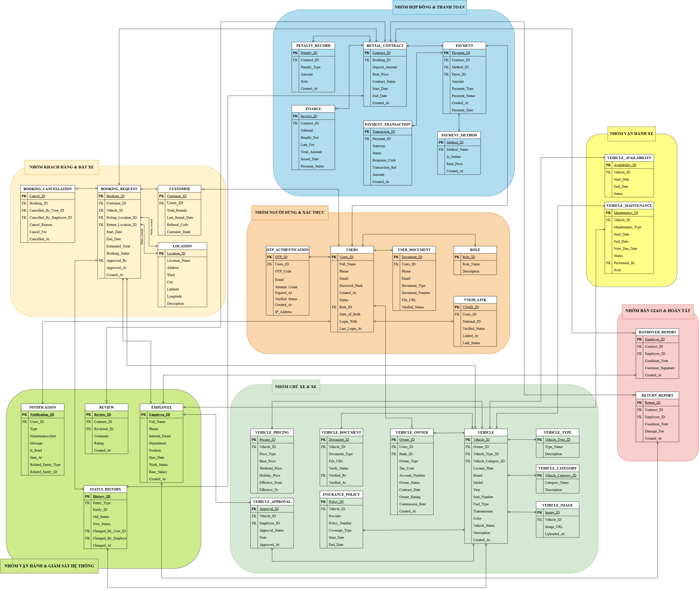
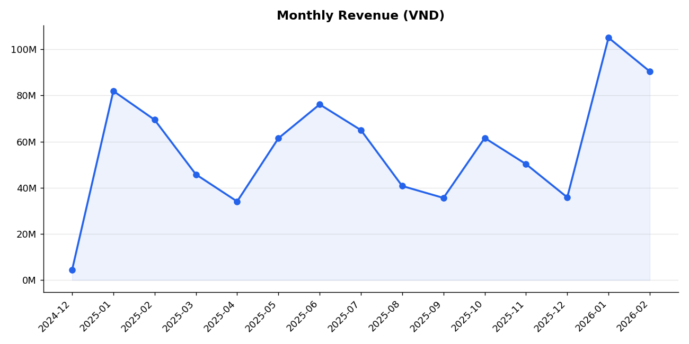
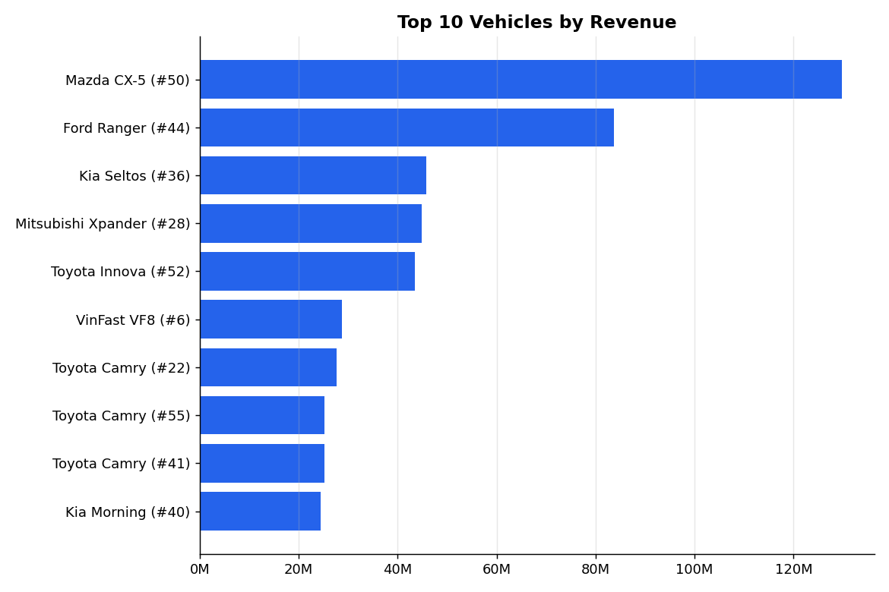
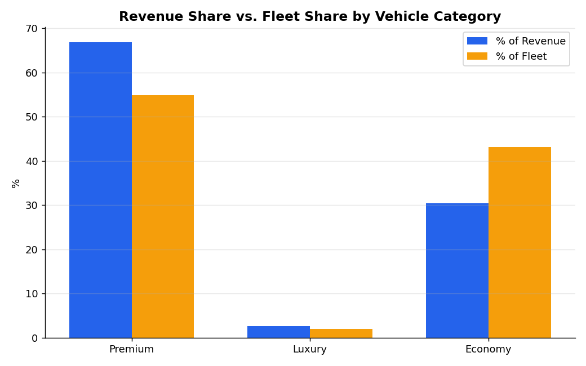
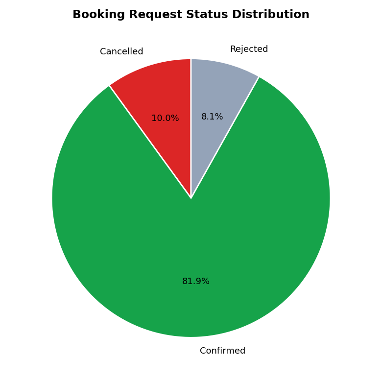
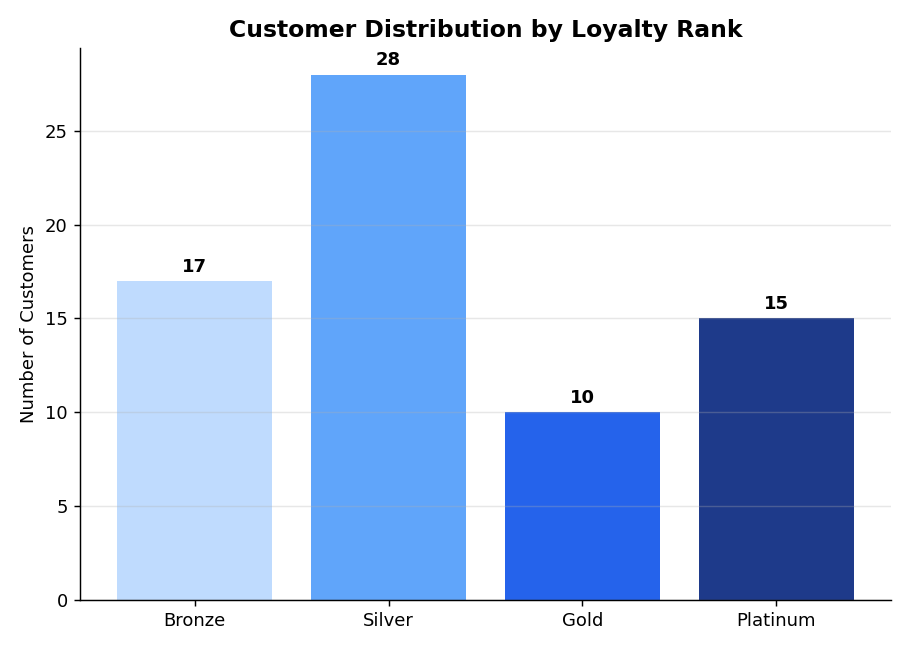
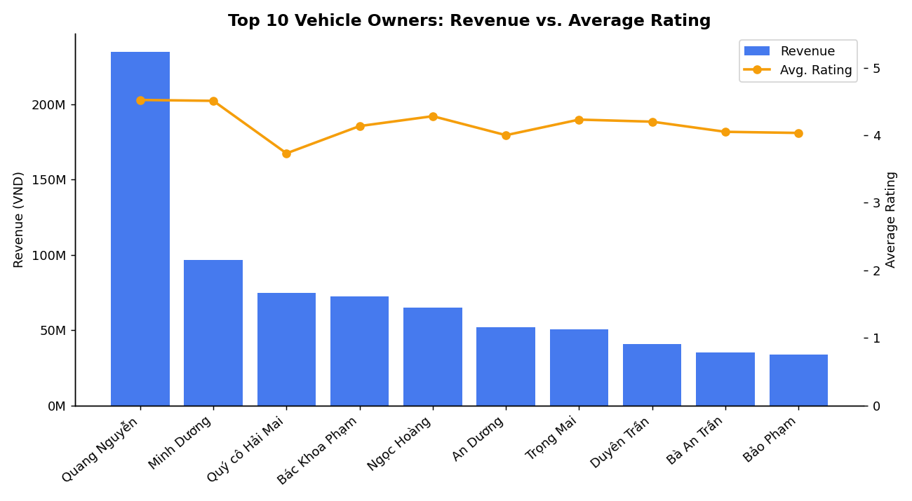

# Database Design & SQL Business Analysis - Car Rental Service 

Database design and business data analysis for a short-term car rental platform (similar to Turo or Mioto). The project started as a university assignment for a Database course. It has since been extended with sample data, a set of business queries, and analysis charts, to show how the underlying data can be turned into insights that support business decisions.

[]()
[]()
[](LICENSE)

---

## Overview

Most self-drive car rental businesses in Vietnam are still run manually, using paper records, spreadsheets, and phone calls. This leads to lost information, double bookings, and no reliable way to track revenue.

This project builds a single, centralized database that supports the full rental process: user registration, vehicle listing, booking, electronic contracts, escrow-based payment, vehicle handover and return, and customer reviews.

Using this database, the project also answers common business questions, such as: which vehicles generate the most revenue, which customers deserve priority support, when demand peaks during the year, and which vehicle segment performs best.

## Tech Stack

| Component | Tool |
|---|---|
| Database design | Entity-Relationship Diagram, normalized schema (3NF) |
| Query language | SQL (SQLite dialect, portable to MySQL/PostgreSQL) |
| Sample data generation | Python |
| Analysis and visualization | Python |

## Project Structure

```
car-rental-database-analysis/
├── 01_schema/
│   └── schema.sql                # DDL: 32 tables, primary/foreign keys, indexes
├── 02_sample_data/
│   ├── generate_data.py          # Script that generates realistic sample data
│   └── seed_data.sql             # INSERT statements exported from the script above
├── car_rental.db                 # Pre-built SQLite database, ready to query
├── 03_business_queries/
│   ├── q01 ... q15_*.sql         # 15 queries answering business questions
│   ├── run_all_queries.py        # Script that runs all 15 queries automatically
│   └── results/results.md        # Actual output of each query
├── 04_analysis/
│   ├── analysis.py               # Analysis script that also exports the charts
│   └── charts/                   # 6 charts summarizing key insights
├── docs/
│   ├── ERD.md                    # Simplified ER diagram 
│   └── images/erd_diagram.png    # Full ER diagram from the original design report
├── LICENSE
└── README.md
```

## Entity-Relationship Diagram

The diagram below is the full ER diagram from the original design report. It shows all 32 tables, grouped into 7 functional areas: User & Authentication, Vehicle Owner & Vehicle, Vehicle Operations, Customer & Booking, Contract & Payment, Handover & Return, and System Operations & Monitoring.



A simplified, GitHub-renderable version of the same diagram (grouped by functional area, using Mermaid syntax) is available in [`docs/ERD.md`](docs/ERD.md).

## Running the Project

```bash
git clone https://github.com/<your-username>/car-rental-database-analysis.git
cd car-rental-database-analysis

# Option 1: use the database that is already built
sqlite3 car_rental.db < 03_business_queries/q07_top_revenue_vehicle.sql

# Option 2: rebuild everything from scratch
pip install faker pandas matplotlib
cd 02_sample_data && python3 generate_data.py       # rebuilds car_rental.db and seed_data.sql
cd ../03_business_queries && python3 run_all_queries.py   # runs all 15 queries, writes results.md
cd ../04_analysis && python3 analysis.py             # writes 6 charts to charts/
```

All data used here is synthetically generated, not real customer or transaction data. The generation script intentionally builds in realistic business patterns, including seasonal demand peaks around holidays and summer, a concentration of revenue in a small set of vehicles, and a distinct tier of high-value customers, so the analysis reflects the kind of patterns found in real rental data.

---

## Business Questions and Key Insights

All 15 queries are in [`03_business_queries/`](03_business_queries), and their actual output is recorded in [`results.md`](03_business_queries/results/results.md). A few insights from the sample data:

### 1. Monthly revenue shows a clear seasonal pattern



Revenue rises sharply in January (Tet holiday) and June (summer travel season), matching typical demand for road trips and family visits. This supports planning for fleet size and seasonal pricing (`Vehicle_Pricing.Holiday_Price`) ahead of these periods.

### 2. Revenue is concentrated in a small group of vehicles



A small set of vehicles accounts for a large share of total revenue. Studying what these vehicles have in common (model, price point, location) could help guide new vehicle owners toward higher-performing choices.

### 3. The premium segment outperforms its share of the fleet



Premium vehicles make up about 55% of the fleet but generate about 67% of revenue, while economy vehicles make up 43% of the fleet but only about 30% of revenue. This suggests it may be worth prioritizing outreach to owners of premium vehicles.

### 4. A meaningful share of bookings are cancelled or declined



About 10% of bookings are cancelled by customers, and about 8% are declined by vehicle owners. Both directly affect customer experience and fleet utilization, and are worth monitoring over time.

### 5. Most customers are still in the lower loyalty tiers



Most customers are ranked Bronze or Silver. There is room to build a loyalty program that moves more customers into the Gold or Platinum tiers, which already show noticeably higher average spending (see queries 03 and 10).

### 6. Higher-earning vehicle owners also tend to have better ratings



Vehicle owners with higher revenue also tend to have higher customer ratings. This points to a link between service quality and earnings, and could support a ranking system that gives better-rated vehicles more visibility on the platform.

---

## List of Business Queries

| # | Business Question | File |
|---|---|---|
| 01 | Look up booking history by customer name | [q01](03_business_queries/q01_bookings_by_customer_name.sql) |
| 02 | Which vehicles have been rented more than 5 times? | [q02](03_business_queries/q02_vehicles_rented_over_5_times.sql) |
| 03 | Which customers spend above the average? | [q03](03_business_queries/q03_customers_above_average_spending.sql) |
| 04 | Which contracts have unusually high penalty fees? | [q04](03_business_queries/q04_contracts_with_high_penalty.sql) |
| 05 | Which vehicles have never been rented? | [q05](03_business_queries/q05_vehicles_never_rented.sql) |
| 06 | Which customers cancel bookings frequently? | [q06](03_business_queries/q06_customers_frequent_cancellations.sql) |
| 07 | Top 10 vehicles by revenue | [q07](03_business_queries/q07_top_revenue_vehicle.sql) |
| 08 | Which contracts expire within the next 3 days? | [q08](03_business_queries/q08_contracts_expiring_soon.sql) |
| 09 | Which vehicles have overlapping maintenance and booking schedules? | [q09](03_business_queries/q09_maintenance_overlapping_booking.sql) |
| 10 | Rank customers by total spending (window function) | [q10](03_business_queries/q10_customer_ranking_by_payment.sql) |
| 11 | Which vehicles earn above the fleet average? (CTE) | [q11](03_business_queries/q11_vehicles_above_average_revenue.sql) |
| 12 | Which customers have never rented an SUV? (targeted marketing) | [q12](03_business_queries/q12_customers_never_rented_suv.sql) |
| 13 | Which contracts were paid for less than the deposit amount? | [q13](03_business_queries/q13_contracts_underpaid_vs_deposit.sql) |
| 14 | Which vehicle had the longest maintenance period? | [q14](03_business_queries/q14_longest_maintenance_vehicle.sql) |
| 15 | Monthly revenue and month-over-month growth (window function, LAG) | [q15](03_business_queries/q15_monthly_revenue_growth.sql) |

## Skills Demonstrated

- **Data modeling for analysis**: designed a normalized schema (32 tables, primary/foreign keys, constraints) that keeps revenue, bookings, and customer activity consistent and easy to query and report on.
- **Business-question-driven SQL**: translated open-ended questions ("who are our best customers?", "which vehicles underperform?") into multi-table `JOIN`, `GROUP BY` / `HAVING`, and subqueries.
- **Segmentation and ranking**: used window functions (`RANK() OVER`) to rank customers by spend and identify top and bottom performers within a group.
- **Trend analysis**: used `LAG() OVER` to calculate month-over-month revenue growth and surface seasonal patterns.
- **Readable, reusable logic**: structured complex queries with Common Table Expressions (`WITH`) instead of nested subqueries, so the logic stays easy to follow and modify.
- **Gap and exception analysis**: used `NOT EXISTS` to find customers who never rented a given vehicle type, and correlated subqueries to flag contracts or vehicles that deviate from the norm (unpaid deposits, unusually high penalties).
- **Date-based operations**: handled overlapping date ranges and time calculations (`julianday`, `strftime`) for scheduling checks, such as detecting maintenance periods that conflict with active bookings.
- **Query performance awareness**: applied indexing on frequently filtered and joined columns to keep reporting queries responsive as data volume grows.

## License

Released under the [MIT License](LICENSE) — free to use for learning and reference purposes.
