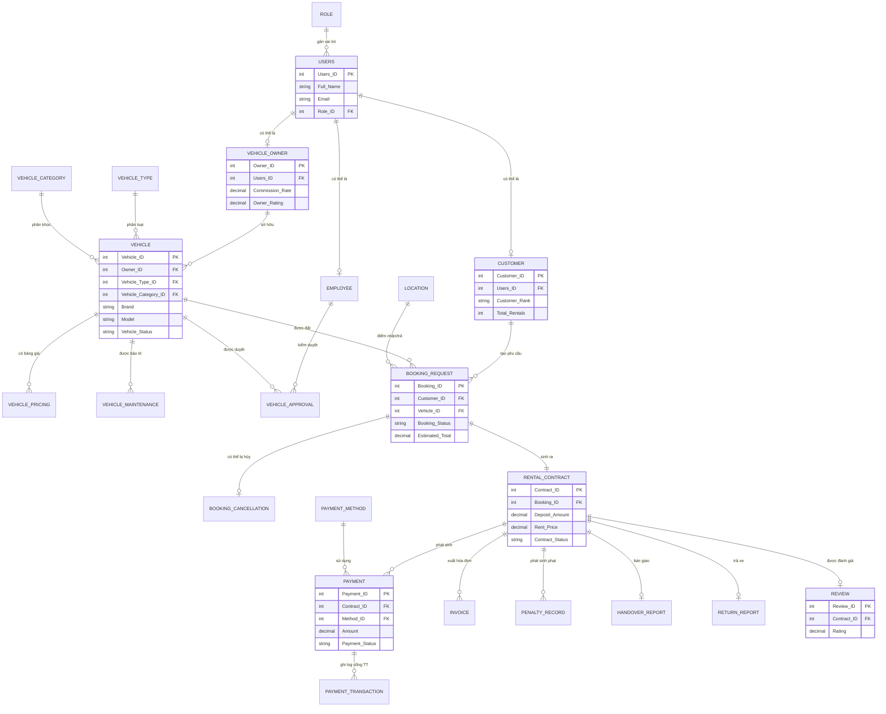

# Sơ đồ quan hệ thực thể (ERD) — rút gọn các nhóm chính

> Sơ đồ đầy đủ 32 bảng nằm trong báo cáo đồ án gốc (`docs/full_report.pdf`, nếu bạn đính kèm).
> Bên dưới là ERD rút gọn theo 7 nhóm nghiệp vụ, đủ để hiểu luồng dữ liệu chính.
> GitHub sẽ tự render sơ đồ Mermaid này trực tiếp trong trang repo.

## Tóm tắt 7 nhóm bảng

| Nhóm | Các bảng chính |
|---|---|
| 1. Người dùng & Xác thực | Role, Users, User_Document, OTP_Authentication, VNeID_Link |
| 2. Chủ xe & Xe | Vehicle_Owner, Vehicle, Vehicle_Type, Vehicle_Category, Vehicle_Image, Vehicle_Document, Vehicle_Pricing, Insurance_Policy, Vehicle_Approval |
| 3. Vận hành xe | Vehicle_Availability, Vehicle_Maintenance |
| 4. Khách hàng & Đặt xe | Customer, Location, Booking_Request, Booking_Cancellation |
| 5. Hợp đồng & Thanh toán | Rental_Contract, Payment, Payment_Transaction, Payment_Method, Invoice, Penalty_Record |
| 6. Bàn giao & Hoàn tất | Handover_Report, Return_Report |
| 7. Vận hành & Giám sát hệ thống | Employee, Review, Notification, Status_History |

Toàn bộ 32 bảng và định nghĩa chi tiết được cài đặt tại [`01_schema/schema.sql`](../01_schema/schema.sql).
